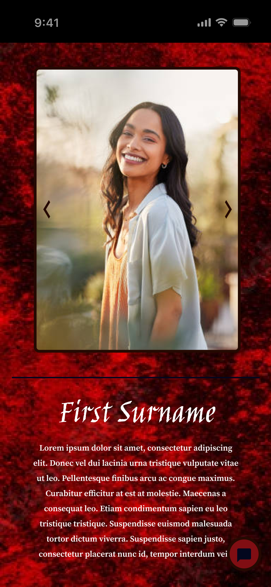
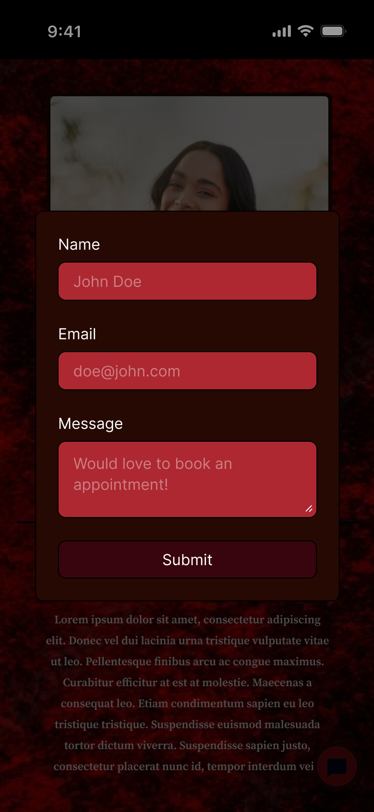

# Professional Portfolio

A full-stack web application that aims to display a creative and/or professional portfolio, with the addition of an automated contact form, optional bookings page, and editing page for the professional to adapt the web application to suit their needs.

## Pages

### Root display page

Includes text content, an interactable gallery and contact button which will open a contact form.

- The current method of contact will be an automated email - will require 1 submit per minute limit rule on frontend.
- The gallery is an image display
- On the edit page, an admin should be able to edit the order and remove or add images, in addition to modifying the overall colour scheme, fonts and the title and body text.

#### Mobile Wireframes

### Bookings

### Edit

## Features
